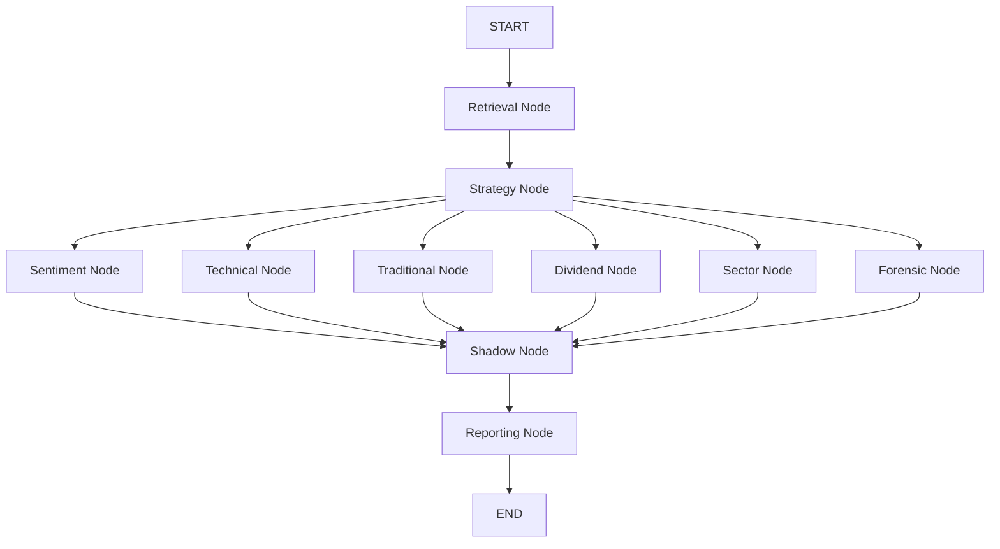

# 🤖 Market-Rover Agentic AI Constitution

This document serves as the **Single Source of Truth** for the Agentic AI system within Market Rover. It details the roles, responsibilities, capabilities, and interactions of every agent in the ecosystem.

---

## 🧠 The v5 Intelligence Graph (LangGraph)
The system has evolved from a linear funnel into a **Stateful, Parallel LangGraph**. Agents operate concurrently to reduce latency and allow for non-linear, state-aware reasoning:

---

## 🕵️ Headless Execution (Automated Governance)
Beyond user interaction, the **Strategist** and **SRE Agents** maintain the system autonomously through:
1.  **Daily Market Intelligence**: Automated logic posting to GitHub Discussions.
2.  **Federated Satellite Monitoring**: Real-time failure alerts from **Investbrand** and **Pledge-Rover** sent to the HIL Dashboard.

---

## 🕵️ Agent Roster (Core & Satellite)

### 1-10. Core Analysis Crew (LangGraph Nodes)
*Orchestrated by Gemini 3.0-Flash and LangGraph (FastAPI v5 Backend).* [OK]

1.  **Retrieval Node**: The Gatekeeper. Validates symbols, fetches historical data via `yfinance`, and initializes global state.
2.  **Strategy Node**: The Macro-Economist. Maps global cues (VIX, DXY, Yields) to the **Quadratic Regime** (Goldilocks/Panic).
3.  **Sentiment Node**: The Psychologist. Parses latest news via Newspaper3k and classifies sentiment scores.
4.  **Technical Node**: The Technician. Calculates MTC (Triple Concordance) and identifies key support/resistance levels.
5.  **Traditional Node**: The Cultural Mapper. Monitors **Muhurtham Windows** and seasonal patterns (Budget/Festive rallies).
6.  **Dividend Node**: The Income Specialist. Evaluates yield quality, payout patterns, and corporate action impacts.
7.  **Sector Node**: The Flow Specialist. Checks sector-wide relative strength and institutional rotation.
8.  **Forensic Node**: The Auditor. Analyzes red flags, fundamental outliers, and "Self-Correction" events.
9.  **Shadow Node**: The Forensic Detective. Merges all parallel inputs to detect **Institutional Bull/Bear Traps**.
10. **Reporting Node**: The Intelligence Officer. Conducts final synthesis, generates Markdown reports, and appends **Feedback**.

### 11-13. Satellite & SRE Crew
*Orchestrated by Gemini 3.0-Flash and Node.js.*
*   **Investbrand Puzzle Agent**: Generates the "Brand to Stock" gamified challenges.
*   **Adaptive Teacher**: Contextualizes gameplay with micro-learning insights.
*   **Operational SRE Support**: Intercepts runtime exceptions and routes critical failures to the **HIL Mission Control**.

---

## 📜 Global Agent Rules (Governance Framework)

### 1. The Batch Imperative
*   **Rule**: Never iterate through stocks sequentially. Always use `Batch Tools`.
*   **Reason**: Performance and token efficiency.

### 2. The Low-Latency Directive
*   **Rule**: Strict `max_iter` limit (3-5). No infinite reasoning loops.

### 3. The Ironclad Security Rule
*   **Rule**: Never log or output secrets. Sanitize every agent input via `utils/security.py`.

### 4. The Resilience Protocol
*   **Rule**: Fail gracefully. Fallback from Option Chains to Historical Volatility if data is missing.

### 5. The Production Standard
*   **Rule**: Primary Brain must be **Gemini 3.0-Flash**. Verify UTF-8 compliance and Python 3.13 compatibility across ALL modules (including Satellite Dockerfiles) before every push.

### 6. The Unicode Scrub Rule
*Rule*: **No emojis** in `.github/workflows/`, `Dockerfile`, or `.env`. Use standard text markers like `[OK]` or `[ALERT]`.

### 7. Global Integrity Check
*Rule*: All changes to infrastructure or satellite modules MUST pass `python scripts/build_integrity_check.py`.

### 7. The Multi-Provider Social Governance Shield
*   **Rule**: Maintain **Open Access** while protecting the UI.
*   **Reason**: Clients should never see technical provider errors (e.g. "Invalid App ID").
*   **Implementation**: If a provider uses a placeholder ID, the **Social Manager Shield** must intercept and show a friendly internal warning.

### 8. The Federated Satellite Rule
*   **Rule**: Every satellite module (Investbrand, Pledge-Rover) MUST report failures to the central HIL Dashboard.
*   **Reason**: Eliminates "Silent Failures" and ensures total system transparency.

---

## 📊 Agent KPI Matrix
| Agent | Primary KPI | Target | Measuring Logic |
| :--- | :--- | :--- | :--- |
| **Strategist** | Funnel Integrity | >90% | Successfully links Macro -> Micro news. |
| **SRE Agent** | Deployment Stability | 100% | Zero syntax regressions reaching main. |
| **SRE Agent** | TTR (Hotfix) | < 15m | Autonomous recovery time for CI incidents. |

---

**Built with LangGraph, FastAPI, Gemini 3.0-Flash, and Google Cloud Run.** [OK]
*Last Unified Update: April 20, 2026 (v5 Migration Model Update)*
