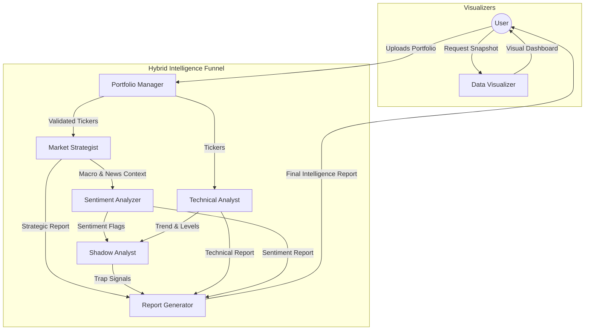

# 🤖 Market Rover AI Agent Architecture

This document serves as the **Single Source of Truth** for the Agentic AI system within Market Rover. It details the roles, responsibilities, capabilities, and interactions of each agent in the `CrewAI` assembly.

> **MAINTENANCE NOTE:** This file must be updated whenever changes are made to `agents.py` or `tasks.py`.

---

## 🧠 The Hybrid Intelligence Funnel
The agents operate in a sequential pipeline designed to mimic a hedge fund's decision-making process:
`Portfolio Manager` -> `Strategist` -> `Sentiment` -> `Technical` -> `Shadow Analyst` -> `Report Writer`
    

---

## 🕵️ Headless Execution (Automated Reports)

While agents typically respond to user clicks, the **Report Generator** and **Strategist** agents also run in **Headless Mode** via GitHub Actions to generate:
1.  **Daily Market Intelligence**: Runs `rover_tools/generate_daily_report.py`.
2.  **Weekly Strategy Backtest**: Runs `rover_tools/batch_backtester.py`.

These workflows execute the same agent logic but output directly to **GitHub Discussions** instead of the Streamlit UI.

---

## 🕵️ Agent Roster

### 1. Portfolio Manager (Agent A)
*   **Source:** `agents.py` -> `create_portfolio_manager_agent`
*   **Role:** The Gatekeeper
*   **Goal:** Read and process the user's stock portfolio to ensure accurate tracking.
*   **Key Responsibilities:**
    *   Reads `.csv` portfolio inputs.
    *   Standardizes symbols (e.g., appending `.NS` for NSE).
    *   Validates data integrity before passing it downstream.
*   **Tools:** `read_portfolio`

### 2. Market Impact Strategist (Agent B)
*   **Source:** `agents.py` -> `create_news_scraper_agent`
*   **Role:** The Macro-Economist
*   **Goal:** Identify multi-layered market risks by monitoring macro events, global cues, and specific news.
*   **Key Responsibilities:**
    *   **Macro Scan:** Checks Crude, Gold, Nasdaq, and USD/INR.
    *   **Official Data:** Monitors Board Meetings, Results, and Dividends.
    *   **Funnel Logic:** Connects global events to portfolio stocks (e.g., "Crude up -> Paints down").
*   **Tools:** 
    *   `search_market_news` (Macro)
    *   `get_global_cues` (Indices/Commodities)
    *   `get_corporate_actions` (Official NSE data)
    *   `batch_scrape_news` (Portfolio specific)

### 3. Sentiment Analysis Expert (Agent C)
*   **Source:** `agents.py` -> `create_sentiment_analyzer_agent`
*   **Role:** The Psychologist
*   **Goal:** Quantify market emotion (Fear vs. Greed).
*   **Key Responsibilities:**
    *   Classifies news sentiment as Positive, Negative, or Neutral.
    *   **Critical Output:** Flags "Extreme Sentiment" (Panic/Euphoria) which is the primary input for the Shadow Analyst's trap detection.
*   **Tools:** *Reasoning only context-aware Agent*

### 4. Technical Market Analyst (Agent D)
*   **Source:** `agents.py` -> `create_market_context_agent`
*   **Role:** The CMT (Chartered Market Technician)
*   **Goal:** Analyze Price Action, Trends, and Levels.
*   **Key Responsibilities:**
    *   Ignores news entirely; focuses only on the Chart.
    *   Determines Trend (Uptrend/Downtrend) and Support/Resistance.
    *   Provides the "Where" to the Strategist's "Why".
*   **Tools:** 
    *   `analyze_market_context`
    *   `batch_get_stock_data`

### 5. Institutional Shadow Analyst (Agent G)
*   **Source:** `agents.py` -> `create_shadow_analyst_agent`
*   **Role:** The Forensic Detective
*   **Goal:** Detect Market Traps (Accumulation/Distribution) by comparing Sentiment vs. Flow.
*   **Key Responsibilities:**
    *   **Silent Accumulation:** Detects when Retail is fearful (Sentiment) but Smart Money is buying (Block Deals/Support).
    *   **Bull Traps:** Detects when Retail is euphoric but Price is hitting resistance.
    *   Uses 'Trap Indicators' to find divergences.
*   **Tools:** 
    *   `analyze_sector_flow_tool`
    *   `fetch_block_deals_tool`
    *   `batch_detect_accumulation`
    *   `get_trap_indicator_tool`

### 6. Intelligence Report Writer (Agent E)
*   **Source:** `agents.py` -> `create_report_generator_agent`
*   **Role:** The Editor
*   **Goal:** Synthesize all insights into a comprehensive weekly report.
*   **Key Responsibilities:**
    *   Aggregates the "Intelligence Mesh" (Strategy + Technicals + Shadow).
    *   Produces the actionable Executive Summary and Risk Highlights.
    *   Formats the output for the Streamlit UI.
*   **Tools:** *Reasoning only context-aware Agent*

### 7. Market Data Visualizer (Agent F)
*   **Source:** `agents.py` -> `create_visualizer_agent`
*   **Role:** The Artist
*   **Goal:** Generate premium visual dashboards.
*   **Key Responsibilities:**
    *   Creates visual market snapshots (Charts).
    *   Visualizes Volatility and Option Chains.

---

## 🎮 InvestBrand Agent Roster (Node.js/LangChain)

The following agents run autonomously within the InvestBrand Node.js backend using `@langchain/google-genai` to drive personalized gamification and micro-learning.

### 8. Contextual Profiler Agent
*   **Source:** `investbrand/backend/src/agents/profilerAgent.js`
*   **Role:** The Assessor
*   **Goal:** Determine user financial literacy through gameplay behavior.
*   **Key Responsibilities:**
    *   Analyzes the user's historical portfolio votes (defensive, cyclical, speculative).
    *   Generates a Persona Tag (e.g., "Yield Hunter") and a Reading Level (beginner, intermediate, advanced).
    *   Saves this profile to adapt future interactions.

### 9. Adaptive Gamemaster Agent
*   **Source:** `investbrand/backend/src/agents/gamemasterAgent.js`
*   **Role:** The Orchestrator
*   **Goal:** Keep players engaged with dynamic, procedurally generated daily challenges.
*   **Key Responsibilities:**
    *   Reads the user's latest voting patterns via PostgreSQL.
    *   Formulates a counter-strategy or expansion mission (e.g., if a user votes exclusively on IT, it challenges them to research FMCG).
    *   Enforces strict JSON schema output for seamless React UI ingestion.

### 10. Contextual Teacher Agent
*   **Source:** `investbrand/backend/src/agents/teacherAgent.js`
*   **Role:** The Educator
*   **Goal:** Contextualize gameplay with real-world financial literacy without blocking the user.
*   **Key Responsibilities:**
    *   Triggers ephemerally via `/api/puzzles/:id/insight` exactly when a puzzle is solved.
    *   Reads the user's `user_personas.reading_level`.
    *   Generates a 2-sentence micro-learning insight about the specific corporate brand (e.g. debt-to-equity ratio vs simple analogies).

### 11. Quality Control Agent (Moderator)
*   **Source:** `investbrand/backend/src/agents/qcAgent.js`
*   **Role:** The Auditor
*   **Goal:** Maintain visual and functional integrity of the game assets.
*   **Key Responsibilities:**
    *   Scans `puzzle_feedback` for "blurry" or "wrong" logo reports.
    *   Autonomously disables broken puzzles by setting `is_active = false`.
    *   Flags difficulty imbalances for manual adjustment.

### 12. Operational Support Agent (SRE)
*   **Source:** `investbrand/backend/src/agents/opsSupportAgent.js`
*   **Role:** The System Guardian
*   **Goal:** Intercept and analyze runtime exceptions to prevent system failure.
*   **Key Responsibilities:**
    *   Injected into the global `errorHandler` middleware.
    *   Parses stack traces using Gemini to identify root causes (Database, API, Logic).
    *   Provides actionable "developer fix" suggestions in the logs.

---

## 📜 Global Agent Rules (The "Constitution")

The following rules apply to **ALL** agents in the workspace. These are non-negotiable best practices derived from past deployment issues and performance audits.

### 1. The Batch Imperative (Performance)
*   **Rule:** **NEVER** iterate through a list of stocks one by one.
*   **Reason:** Sequential LLM calls are too slow (30s+ per stock).
*   **Implementation:** Always use Batch Tools (e.g., `batch_scrape_news`, `batch_get_stock_data`).
    *   ❌ Incorrect: Loop `get_stock_data(ticker)`
    *   ✅ Correct: Call `batch_get_stock_data([list_of_tickers])`

### 2. The Low-Latency Directive (Efficiency)
*   **Rule:** Agents have a strict `max_iter` limit (usually 3-5).
*   **Reason:** Prevents infinite reasoning loops that burn tokens and delay response.
*   **Implementation:**
    *   Strategist/Context Agents: `max_iter=3`
    *   Shadow Analyst: `max_iter=5`
    *   **Do not loop** looking for "better" news. Synthesize what you find in step 1.

### 3. The Ironclad Security Rule
*   **Rule:** **NEVER** output or log API keys or raw user session data.
*   **Reason:** Security compliance.
*   **Implementation:**
    *   Sanitize all LLM inputs.
    *   Ensure `.env` acts as the only source of secrets.

### 4. The Resilience Protocol (Error Handling)
*   **Rule:** Agents must **fail gracefully**, not crash.
*   **Reason:** Real market data is messy (e.g., missing Option Chains).
*   **Implementation:**
    *   If `Option Chain` is empty -> Fallback to `Historical Volatility`.
    *   If `News` is empty -> Fallback to `Price Action` and note "No recent news".
    *   **NEVER** return a raw exception trace to the user.

### 5. The Production Path Rule (Deployment)
*   **Rule:** Verify all imports work in the production environment (Python 3.13).
*   **Reason:** Local paths often differ from Cloud paths (`ModuleNotFoundError`).
*   **Implementation:**
    *   Use absolute imports from root (e.g., `from rover_tools.batch_tools` not `from ..tools`).
    *   Run `python -m py_compile *.py` before pushing.

### 6. The "No Versioning" Rule
*   **Rule:** Do not hardcode versions like "V2.0" or "V3.0" in the UI or docs.
*   **Reason:** It creates confusion (e.g., Title says 2.0, Tab says 4.0).
*   **Implementation:** Refer to features by name (e.g., "Monthly Heatmap", "Market Visualizer").

### 7. The Regular Audit Rule (Maintenance)
*   **Rule:** Conduct a full system audit **Monthly** using `FINAL_AUDIT_CHECKLIST.md`.
*   **Reason:** Prevents "bit rot" and ensures security compliance.
*   **Implementation:** check for outdated deps, deprecated API usage, and security gaps (secrets exposure).

### 8. The Timezone Rule (IST Enforcement)
*   **Rule:** **ALWAYS** use Indian Standard Time (IST, UTC+5:30) for all date, time, scheduling, and calendar calculations across the entire stack (Investbrand backend, frontend, and Python tools).
*   **Reason:** Prevents day-boundary bugs where UTC server times cause streaks or daily tasks to roll over at the wrong hour for Indian users.
*   **Implementation:** Do not use `new Date().toISOString().split('T')[0]` unless strictly converted to IST first using an offset of `+5.5 * 60 * 60 * 1000`.

---

## 📋 Task Mappings (Defined in `tasks.py`)
Understanding which Agent executes which Task is crucial.

| Agent | Task Name | Function Source | Goal |
| :--- | :--- | :--- | :--- |
| **Portfolio Manager** | Task 1: Portfolio Retrieval | `create_portfolio_retrieval_task` | Read & validate user portfolio CSV |
| **Strategist** | Task 2: Market Strategy | `create_market_strategy_task` | Run Hybrid Funnel (Macro -> Official -> Micro) |
| **Sentiment Analyzer** | Task 3: Sentiment Analysis | `create_sentiment_analysis_task` | Classify market emotion (Fear/Greed) |
| **Market Context** | Task 4: Technical Analysis | `create_technical_analysis_task` | Analyze Price Action & Trends (No News) |
| **Shadow Analyst** | Task 5: Shadow Analysis | `create_shadow_analysis_task` | **Synergy Task**: Compare Sentiment vs Price vs Flow |
| **Report Generator** | Task 6: Report Generation | `create_report_generation_task` | Synthesize Master Intelligence Report |
| **Visualizer** | Snapshot Task | `create_market_snapshot_task` | Generate single-stock visual dashboard |

