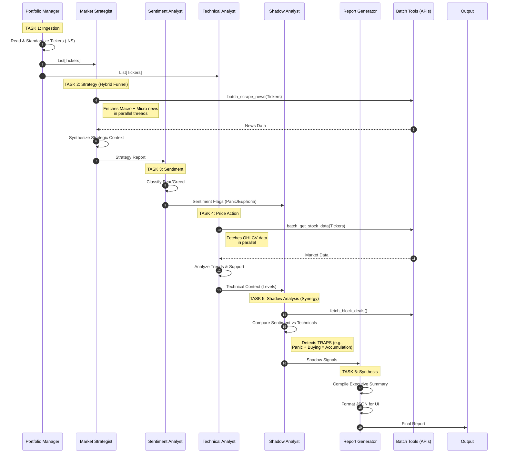

# Market-Rover Technical Architecture

This document details the internal architecture of Market-Rover, focusing on its component structure, operational workflows, and multi-agent orchestration.

---

## 1. High-Level Component Diagram

This diagram illustrates the separation of concerns between the compiled Python runtime (Streamlit), the Agentic Core, and external data sources.

```mermaid
graph TB
    %% Styles
    classDef frontend fill:#e1f5fe,stroke:#01579b,stroke-width:2px;
    classDef core fill:#e8f5e9,stroke:#1b5e20,stroke-width:2px;
    classDef tools fill:#fff3e0,stroke:#e65100,stroke-width:2px;
    classDef external fill:#f3e5f5,stroke:#4a148c,stroke-width:2px;
    classDef storage fill:#eceff1,stroke:#607d8b,stroke-width:2px;

    subgraph UserLayer [User Interface Layer]
        direction TB
        UI[Streamlit App\n(app.py)]:::frontend
        Tabs[UI Tabs\n(tabs/*)]:::frontend
        UI --> Tabs
    end

    subgraph LogicLayer [Agentic Core Layer]
        direction TB
        CrewEngine[Crew Engine\n(crew_engine.py)]:::core
        Agents[Agent Definitions\n(agents.py)]:::core
        Tasks[Task Definitions\n(tasks.py)]:::core
        
        CrewEngine --> Agents
        CrewEngine --> Tasks
    end

    subgraph ToolLayer [Tooling & Utilities]
        direction TB
        Tools[Rover Tools\n(rover_tools/*)]:::tools
        Utils[Shared Utilities\n(utils/*)]:::tools
    end

    subgraph DataLayer [Data & Storage]
        direction TB
        Reports[Reports Directory\n(reports/*)]:::storage
        Logs[Logs & Metrics\n(logs/*, .gemini/*)]:::storage
        Cache[Local Cache]:::storage
    end

    subgraph ExternalServices [External Services]
        direction TB
        LLM[Google Gemini API]:::external
        YF[Yahoo Finance API]:::external
        Search[Serper/Google Search]:::external
        NSE[NSE/BSE Indices]:::external
    end

    %% Connections
    UI -- "1. Trigger Analysis" --> CrewEngine
    Tabs -- "Read Reports" --> Reports
    
    CrewEngine -- "2. Orchestrate" --> Tools
    Agents -- "Uses" --> Tools
    
    Tools -- "Fetch Data" --> ExternalServices
    Tools -- "Fetch Data" --> YF
    Tools -- "Fetch Data" --> Search
    
    Agents -- "Reasoning" --> LLM
    
    CrewEngine -- "3. Save Output" --> Reports
    Utils -- "Track" --> Logs

    linkStyle default stroke-width:1px,fill:none,stroke:#455a64;
```

---

## 2. The Operational Workflow ("The Loop")

This flowchart depicts the end-to-end execution path when a user initiates a market analysis.

```mermaid
flowchart TD
    %% Nodes
    Start((Start))
    Upload[User Uploads Portfolio.csv]
    Validate{Validate CSV}
    Error[Show Error Toast]
    InitCrew[Initialize MarketRoverCrew]
    
    subgraph ExecutionLoop [Execution "Loop"]
        Kickoff[Crew.kickoff()]
        Task1[Task 1: Portfolio Retrieval]
        Task2[Task 2: Strategy Funnel\n(Batch API Calls)]
        Task3[Task 3: Sentiment Analysis]
        Task4[Task 4: Technical Analysis]
        Task5[Task 5: Shadow Analysis]
        Task6[Task 6: Report Generation]
    end
    
    Save[Save Report to /reports]
    Parse[Parse JSON Output]
    Display[Render Streamlit UI]
    End((End))

    %% Edge
    Start --> Upload
    Upload --> Validate
    Validate -- Invalid --> Error
    Validate -- Valid --> InitCrew
    InitCrew --> Kickoff
    
    %% The Loop Flow
    Kickoff --> Task1
    Task1 --> Task2
    Task2 --> Task3
    Task3 --> Task4
    Task4 --> Task5
    Task5 --> Task6
    
    Task6 --> Save
    Save --> Parse
    Parse --> Display
    Display --> End

    %% Styling
    style ExecutionLoop fill:#f9fbe7,stroke:#827717,stroke-dasharray: 5 5
```

---

## 3. Multi-Agent Orchestration Diagram

This diagram details the specific data passing and dependencies between the agents during the `process=Process.sequential` execution.



---

## 4. Observability & Logging

Market-Rover maintains a dual-layer observability stack to ensure issues are captured at both the application and logic levels.

### 4.1 Log Structure

| Type | Location | Retention | Purpose |
| :--- | :--- | :--- | :--- |
| **Application Logs** | `logs/market_rover.log` | 7 Days (Rotated) | Standard `INFO`, `WARNING`, and `ERROR` events from the Python runtime (app startup, API connection failures). |
| **Crash Metrics** | `metrics/errors_YYYY-MM-DD.jsonl` | Permanent | **Critical**: Detailed JSON objects containing full stack traces, user context, and variable states during a crash. |
| **Workflow Events** | `metrics/workflow_events_*.jsonl` | Permanent | Tracks high-level logic flows (e.g., "Consistency Check Failed", "Emergency Override"). |

### 4.2 Debugging Flow

1. **User Reports Issue**: Check `logs/market_rover.log` for the exact time.
2. **Deep Dive**: If an agent failed, open the corresponding `metrics/errors_*.jsonl` file.
   - Look for `"type": "CrewExecutionError"` or `"type": "AgentException"`.
   - The JSON record will contain the `trace` field with the exact line number.
3. **Performance**: Check `metrics/metrics_YYYY-MM-DD.json` for daily API usage stats and latency averages.

### 4.3 Metrics Verification

The system includes a self-verification script:
```bash
python scripts/test_logging_metrics.py
```
Run this to confirm that both the file system logger and the JSONL metrics engine are writable and active.
