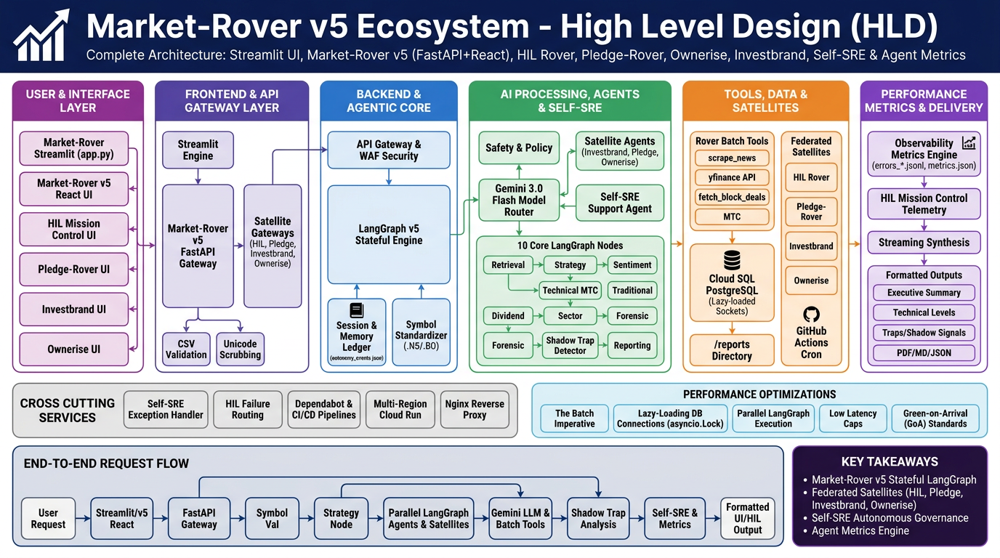

# 🚀 Market-Rover Ecosystem – High Level Design (HLD) v5

This document details the complete **High Level Design (HLD) System Architecture** for the entire **Market-Rover Ecosystem**, encompassing **Market-Rover v5 (FastAPI + React 19)**, **Market-Rover Streamlit App**, **HIL Rover (Mission Control)**, **Pledge-Rover**, **Ownerise**, **Investbrand**, **Self-SRE Governance**, and the **Observability Metrics Engine**.

---

## 📊 High-Level Design (HLD) Diagram



---

## 🏗️ Ecosystem & Architectural Breakdown

### 1. User & Interface Layer
* **Market-Rover Streamlit (`app.py` & `tabs/`)**: Classic Streamlit multi-page interface for portfolio research, interactive heatmaps, benchmark comparisons, and historical report browsing.
* **Market-Rover v5 React UI (`market_rover/frontend`)**: Enterprise decoupled single-page application built with React 19, Vite, TailwindCSS, and shadcn UI components.
* **HIL Mission Control UI (`hil_rover/frontend`)**: Human-in-the-Loop admin dashboard providing real-time telemetry, agent intervention controls, failure inspection, and SRE alerts.
* **Pledge-Rover UI (`pledge_rover/frontend`)**: Dedicated interface for tracking corporate promoter share pledge ratios, margin call risks, and insider pledge trends.
* **Investbrand UI (`investbrand/frontend`)**: Gamified stock discovery platform featuring "Brand-to-Stock" puzzle challenges, AI word clouds, and micro-learning cards.
* **Ownerise UI (`ownerise/backend`)**: Institutional vs. insider ownership analytics interface tracking quarterly holding changes and promoter accumulation.

---

### 2. Frontend & API Gateway Layer
* **Streamlit Runtime Engine**: Python session management, CSV file upload handler, and reactive tab renderer.
* **Market-Rover v5 FastAPI Gateway (`market_rover/backend`)**: Asynchronous, high-concurrency REST & WebSocket API gateway handling authentication, CORS, rate limiting, and request routing.
* **Satellite API Gateways**:
  * `hil_rover/backend`: Mission Control WebSocket & REST telemetry server.
  * `pledge_rover/backend`: Promoter pledge data ingestion and risk alert API.
  * `investbrand/backend`: Gamified challenge generator and brand mapping API.
  * `ownerise/backend`: Insider transaction & holding changes query API.
* **Input Validation & Security**:
  * **CSV Validation**: Validates tickers, portfolio weights, and column structure.
  * **Unicode Scrubbing**: Sanitizes emojis, special characters, and shell control sequences.
  * **OAuth & CORS Security Shield**: Enforces Google OAuth redirect compliance and proxy host checks.

---

### 3. Backend & Agentic Core (LangGraph v5)
* **API Gateway & WAF Security**: OAuth, rate limiting, and security shields (`utils/security.py`).
* **LangGraph v5 Stateful Graph Engine**: Asynchronous state management orchestrating 10 parallel nodes with shared graph state (`state.py`).
* **Session & Memory Ledger**: Maintains portfolio context, user profiles (`data/user_profiles.json`), reasoning memory (`data/memory.json`), and decision logs (`data/autonomy_events.json`).
* **Context & Symbol Standardizer**: Converts raw Indian stock tickers to `.NS` (National Stock Exchange) or `.BO` (BSE) conventions automatically.

---

### 4. AI Processing, Agents & Self-SRE
* **Safety & Policy Layer**: Input sanitization, prompt injection detection, and Unicode/emoji scrubbing.
* **Model Router**: Intelligently routes calls to **Gemini 3.0 Flash** or **Gemini 3 Flash Preview** based on context depth, speed requirements, and task complexity.
* **10 Core LangGraph Agent Nodes**:
  1. **Retrieval Node**: Symbol gatekeeper validating tickers and fetching historical OHLCV data via `yfinance`.
  2. **Strategy Node**: Macro-economic regime classifier (analyzing VIX, DXY, US 10Y Yields into Goldilocks/Panic regimes).
  3. **Sentiment Node**: Parses news articles via `Newspaper3k` and calculates fear/greed sentiment scores.
  4. **Technical Node**: Calculates Triple Concordance (MTC) and identifies key support/resistance levels.
  5. **Traditional Node**: Evaluates seasonal patterns and **Muhurtham Trading** windows.
  6. **Dividend Node**: Analyzes yield quality, payout trends, and corporate action impacts.
  7. **Sector Node**: Evaluates sector-wide relative strength and institutional capital rotation.
  8. **Forensic Node**: Audit engine identifying fundamental outliers, accounting red flags, and self-corrections.
  9. **Shadow Node**: Combines technical and sentiment signals to detect **Institutional Bull/Bear Traps**.
  10. **Reporting Node**: Synthesizes multi-agent outputs, generates Markdown summaries, and formats JSON for UI rendering.
* **Satellite Agents & Self-SRE Crew**:
  * **Self-SRE Support Agent**: Autonomous SRE agent that intercepts runtime exceptions, manages Dependabot PRs, auto-fixes CI regressions, and routes critical failures to the HIL Dashboard.
  * **Investbrand Puzzle Agent**: Generates brand-to-stock challenges and adaptive word clouds.
  * **Pledge Tracker Agent**: Evaluates promoter pledge volatility and high-margin risk flags.
  * **Ownerise Insider Agent**: Monitors insider buying/selling patterns and FII/DII holding changes.

---

### 5. Tools, Data Sources & Federated Satellites
* **Rover Batch Tools (`rover_tools/`)**:
  * `batch_scrape_news`: Parallel news scraping via `Newspaper3k` and Google Search API.
  * `batch_get_stock_data`: Parallel price & volume retrieval via `yfinance`.
  * `fetch_block_deals`: Tracks institutional bulk and block deals on NSE/BSE via `nselib`.
  * Technical Indicators & MTC calculator.
* **Data & Storage**:
  * **Cloud SQL (PostgreSQL)**: Connected via Unix socket DSNs with `asyncio.Lock()` lazy loading to prevent `Errno 111` race conditions.
  * `/reports` Directory: Permanent storage for generated JSON and Markdown research reports.
  * `metrics/*.jsonl`: Structured crash logs (`errors_*.jsonl`), daily latency, and workflow metric streams.
* **Federated Satellites**:
  * **HIL Rover**: Centralized SRE failure telemetry hub.
  * **Pledge-Rover**, **Investbrand**, **Ownerise**.
  * **GitHub Actions Cron Jobs**: Automated daily issue reports and weekly backtests posted to GitHub Discussions.

---

### 6. Agent Performance Metrics & Observability
* **Observability Metrics Engine**:
  * `metrics/errors_YYYY-MM-DD.jsonl`: Structured JSON records capturing full stack traces, user variables, and agent execution states during failures.
  * `metrics/metrics_YYYY-MM-DD.json`: Measures latency averages, token consumption, and daily API call volume.
  * `metrics/workflow_events_*.jsonl`: Logs high-level logic events (*Consistency Checks*, *Emergency Overrides*).
* **HIL Mission Control Telemetry**: Real-time error rates, SRE alerts, and failure recovery metrics.
* **JSON Autonomy Ledger**: Tracks agent memory (`memory.json`), reasoning pivots, and decision logs (`autonomy_events.json`).

---

### 7. Response & Report Delivery
* **Streaming UI Updates**: Real-time task progress and step-by-step agent updates delivered to the UI.
* **Formatted Outputs**: Executive Summary, Technical Level Tables, Traps/Shadow Signals, and PDF/MD/JSON Reports.
* **Delivery Targets**: Market-Rover v5 React UI, Streamlit Dashboard, HIL Mission Control, and GitHub Discussions.

---

## ⚙️ Cross-Cutting Services & Performance Optimizations

| Category | Component / Strategy | Description |
| :--- | :--- | :--- |
| **Self-SRE & Governance** | Self-SRE Support Agent | Intercepts runtime crashes, manages Dependabot PRs, auto-fixes CI regressions, and notifies HIL. |
| **Observability** | `metrics/` & HIL Telemetry | Crash metrics with full stack traces, latency tracking, and workflow event streams. |
| **Federated Satellite Mesh** | HIL, Pledge, Investbrand, Ownerise | Federated microservices reporting failure events to HIL Mission Control. |
| **Performance** | The Batch Imperative | Enforces batch API calls across tickers instead of sequential iteration. |
| **Database Resilience** | Lazy-Loading DB Connections | `asyncio.Lock()` lazy-loading eliminating `Errno 111` race conditions during secret injection. |
| **GoA Parity** | Green-on-Arrival Standards | Strict Python 3.13 compatibility, UTF-8 compliance, and build integrity scripts (`build_integrity_check.py`). |

---

## 🔁 End-To-End Ecosystem Request Flow

```
[User Request / CSV Upload]
          │
          ▼
[Streamlit UI / v5 React UI / Satellite UIs]
          │
          ▼
[FastAPI Gateway (v5 / Satellites)] ──▶ [Self-SRE & Metrics Engine]
          │                                        │
          ▼                                        ▼
[Symbol Validation & Retrieval Node]      [HIL Mission Control]
          │
          ▼
[Macro Strategy Node]
          │
    ┌─────┴──────────────────────────┬──────────────────────────┐
    ▼                                ▼                          ▼
[Sentiment Node]            [Technical Node]          [Forensic/Sector Nodes]
    │                                │                          │
    └──────────────────────────┬─────┴──────────────────────────┘
                               │
                               ▼
                   [Shadow Trap Detector]
                               │
                               ▼
               [Gemini LLM Synthesis & Tools]
                               │
                               ▼
               [Report Synthesizer & Metrics Log]
                               │
                               ▼
                   [Formatted UI Output]
```

---

## 💡 Key Architectural Takeaways

1. **Complete Ecosystem Integration**: Unifies Market-Rover v5 (FastAPI + React 19), Market-Rover Streamlit, HIL Rover, Pledge-Rover, Ownerise, and Investbrand.
2. **Stateful LangGraph Engine**: 10 parallel nodes running concurrently with shared graph state for low-latency financial reasoning.
3. **Self-SRE & HIL Mission Control**: Autonomous exception handling, automated Dependabot management, and real-time SRE failure alerts routed to HIL.
4. **Comprehensive Agent Metrics Engine**: Structured crash logging (`errors_*.jsonl`), daily latency tracking, and autonomy event ledgers (`autonomy_events.json`).
