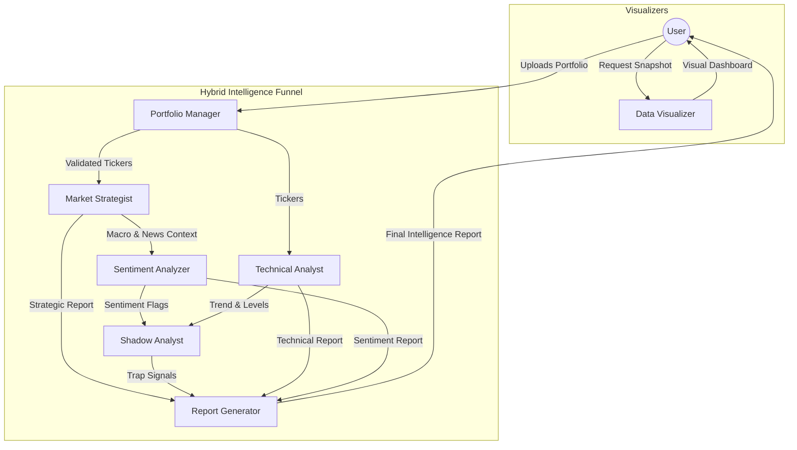

# 🔍 Market-Rover - AI Stock Intelligence Platform

**Your complete toolkit for smart investing decisions powered by cutting-edge AI**


🌐 **Live App:** https://market-rover.streamlit.app/

---

## ✨ Features at a Glance

Market-Rover is an AI-powered platform with a **comprehensive suite of intelligence tools**:

| Feature | Description | Tech Highlights |
|---------|-------------|-----------------|
| **📤 Portfolio Analysis** | AI-driven multi-stock analysis with news & sentiment | CrewAI, Gemini, Parallel Processing |
| **📈 Market Visualizer** | High-fidelity dashboards & Monthly Heatmaps | Plotly, PNG export, IQR Filtering |
| **🔍 Market Analysis** | Benchmark Deep-dives (Nifty, Sensex, Bank Nifty) | Shared Analysis Pipe, st.pills |
| **⚖️ Smart Rebalancer** | Growth vs Safety modes with Corporate Action Auto-Fix | Sharpe Ratio, Risk Parity |
| **🕵️ Shadow Tracker** | **Real Institutional Data** (Block Deals, FII Traps) | nselib, Real-time NSE Data |
| **🎯 Forecast Tracker** | Real-time tracking & management of AI results | yfinance, Interactive st.data_editor |
| **👤 Investor Profiler** | **Model Portfolio Generator** with "Sleep Test" | Asset Allocation, Composite Benchmarking |
| **🛡️ Integrity Shield** | **Forensic Fraud Detection** (Red/Amber Flags) | Balance Sheet Audit, Cash Flow Analysis |
| **🧠 Agent Brain** | **Agent Observability** (Memory, Logic, Pivots) | JSON Ledger, Autonomy Logger |

---

## 🚀 All Features

### **📤 Portfolio Analysis**
*(Sidebar Menu: Portfolio Analysis)*

Upload your portfolio and get comprehensive AI-powered insights:

- ✅ **Multi-Stock Analysis** - Process multiple stocks simultaneously (5x faster with parallel processing)
- ✅ **News Scraping** - Auto-scrape latest news from Moneycontrol using Newspaper3k
- ✅ **Sentiment Analysis** - AI-powered classification (Positive/Negative/Neutral)
- ✅ **Market Context** - Analyze Nifty 50 and sector trends
- ✅ **Weekly Intelligence Reports** - Comprehensive briefings with risk highlights
- ✅ **View Report History** - Browse, search, and download past analyses
- ✅ **Export Options** - HTML format

### **📈 Market Snapshot **

Generate professional market snapshots for sharing:

- ✅ **Price Charts** - Real-time stock price movements with volatility bands
- ✅ **Scenario Targets** - Bull/Bear/Neutral price predictions
- ✅ **Monthly Heatmap** - Historical performance view
- ✅ **AI-Powered Insights** - Gemini-generated market analysis
- ✅ **PNG Export** - Download professional high-res composite dashboard

**Security:** Input sanitization, rate limiting (30 req/min)

### **🔥 Monthly Heatmap **

Deep-dive into historical patterns and future predictions for individual stocks:

- ✅ **Stock Selection Filters** - Instantly filter lists by **Nifty 50**, **Sensex**, or **Bank Nifty**
- ✅ **Centered Heatmap** - Balanced Green-Red color scale for instant pattern recognition
- ✅ **🚫 Outlier Filter** - Exclude extreme market anomalies (>1.5x IQR) for trend accuracy
- ✅ **Interactive Heatmap** - Monthly returns (Year × Month) since IPO
- ✅ **Seasonality Analysis** - Identify best/worst months with **Win Rate %**
- ✅ **3 Forecast Scenarios** - Conservative, Baseline, Aggressive 2026 projections
- ✅ **Iterative Monthly Forecasting** - AI applies strategy month-by-month for granularity.
- ✅ **Continuous Forecast Paths** - Seamless projection from history to current date to 2026 target.

### **📊 Benchmark Analysis **

Specialized focus on major market indices:

- ✅ **Index Deep-Dive** - Analyze Nifty 50, Sensex, Bank Nifty, and Sector Indices
- ✅ **Consolidated Logic** - Uses the same high-fidelity analysis as individual stocks
- ✅ **Market Sentiment** - Assess broader market trends before stock picking

### **⚖️ Smart Portfolio Rebalancer **

Advanced optimization engine to balance Risk and Reward:

- ✅ **Dual Strategy Modes**:
    - **Safe Mode 🛡️**: Risk Parity (Inverse Volatility) for steady growth.
    - **Growth Mode 🚀**: Sharpe Ratio Optimization (Risk-Adjusted Return) for maximum alpha.
- ✅ **Auto-Correction 🧠**: Automatically detects and fixes price anomalies like **Corporate Actions/Demergers** (e.g., ABFRL).
- ✅ **Intelligent Grading**:
    - **Overweight/Underweight**: Exact percentage drift calculation.
    - **Actionable Advice**: "Buy", "Sell", or "Hold" with transparent "Why?" comments.
- ✅ **Resilience**: Handles missing data, new IPOs, and negative return assets gracefully.

### **🕵️ Shadow Tracker (Institutional Spy)**
Track the "Smart Money" with **Real Market Data**:

- ✅ **Whale Alerts 🐋** - Live feed of **Block Deals** (> ₹1 Crore) fetched directly from NSE.
- ✅ **Bull/Bear Trap Detector 🪤** - Analyzes FII Index Futures Long/Short ratios to detect market euphoria or panic.
- ✅ **Silent Accumulation** - Identifies stocks with low volatility + high delivery volume (Pre-breakout signals).
- ✅ **Sector Rotation** - Tracks changes in sector momentum over 1W/1M periods.
- **Tech**: Powered by `nselib` for direct NSE connectivity.

### **🎯 Forecast Tracker **

Monitor your predictions against real market movement:

- ✅ **Live Tracking** - Real-time price updates via `yfinance`
- ✅ **Entry vs. Current** - Automatic calculation of % gains/losses
- ✅ **Portfolio Metrics** - Instant average performance across all saved forecasts
- ✅ **🗑️ Deletion Capability** - Clean up old or inaccurate forecasts through an interactive editor

### **👤 Investor Profiler & Model Portfolio**
*(Sidebar Menu: Investor Profile)*

Scientific asset allocation based on your psychological risk tolerance:

- ✅ **The "Sleep Test"** - 3-step psychometric quiz to determine your Investor Persona (Conservative/Moderate/Aggressive).
- ✅ **Asset Allocation Engine** - Suggests exact % split between Equity (Large/Mid/Small), Debt, and Gold.
- ✅ **🤖 Model Portfolio Generator** - Auto-generates a high-quality stock list matching your allocated percentages.
- ✅ **🚀 Comparison Simulation** - Backtests your generated model portfolio against a **Composite Benchmark** (weighted average of Nifty/Gold/Bonds) to prove Alpha.

### **🛡️ Integrity Shield (Forensic Audit)**
*(Sidebar Menu: Integrity Shield)*

Institutional-grade fraud detection engine to avoid "landmines":

- ✅ **Red Flag Scanner** - Scans Balance Sheets for manipulation (e.g. rising receivables vs falling sales).
- ✅ **Cash Flow Analysis** - Detects "fictitious revenue" by comparing Net Profit vs Operating Cash Flow.
- ✅ **Simple Badge System** - Returns **CLEAN**, **CAUTION**, or **CRITICAL RISK** status instantly.

### **⚙️ System Health (New)**

Monitor the efficiency of the development cycle itself:

- ✅ **Cycle Time Tracking** - Measure how long features take to build.
- ✅ **Exception Audit** - Track every "Emergency Override" or broken rule.
- ✅ **Stability Score** - Dynamic score based on protocol adherence.

### **🧠 Agent Brain (Autonomy Monitor)**
*(Sidebar Menu: Agent Brain)*

Visualize the **internal thought process** of your AI agents:

- ✅ **Active Memory Viewer** - See the exact "Past Predictions" the agents are recalling.
- ✅ **Autonomy Event Stream** - Track real-time decisions like "Regime Changes" and "Tool Pivots".
- ✅ **Live Logic Matrix** - Understand WHY the agent switched to "Defensive Mode".

**Security:** Input sanitization, rate limiting (20 req/min), persistent session state.

---

## 🏗️ Architecture

### Multi-Agent AI System

Market-Rover uses **5 specialized AI agents** orchestrated by CrewAI:



**Key Technologies:**
- **CrewAI**: Multi-agent orchestration
- **Google Gemini 1.5 Flash**: LLM for reasoning & analysis
- **yfinance**: Free NSE/BSE stock data
- **Newspaper3k**: Web scraping engine
- **Streamlit + Plotly**: Interactive web UI

---

## 🚀 Quick Start

### Prerequisites

- Python 3.13 (Strict requirement for CrewAI compatibility)
- Google Gemini API key ([Get free key](https://makersuite.google.com/app/apikey))

### Installation

```bash
# 1. Clone repository
cd Market-Rover

# 2. Install dependencies
pip install -r requirements.txt

# 3. Set up environment
copy .env.example .env
# Edit .env and add: GOOGLE_API_KEY=your_key_here

# 4. Run the app
streamlit run app.py
# Opens at http://localhost:8501
```

---

## 📊 Usage Guide

### **Portfolio Analysis**

1. **Upload Portfolio CSV**
   ```csv
   Symbol,Company Name,Quantity,Average Price
   RELIANCE,Reliance Industries Ltd,10,2450.50
   TCS,Tata Consultancy Services,5,3550.00
   INFY,Infosys Ltd,15,1450.75
   ```

2. **Click "Analyze Portfolio"**
   - AI agents scrape news, analyze sentiment
   - Generate comprehensive intelligence report
   - View charts and download results

3. **Browse Previous Reports**
   - Scroll down to see report history
   - Filter and search
   - Download in multiple formats

### **Market Snapshot**

1. Enter stock ticker (e.g., `SBIN`, `TCS`, `RELIANCE`)
2. Click **"Generate Snapshot"**
3. Wait ~30 seconds for the high-fidelity composite image
4. **Download PNG** to share with colleagues or save for records

### **Monthly Heatmap & 2026 Forecast**

1. Select/Search for a stock or enter a custom ticker
2. **Filter by Index**: Use "Nifty 50" or "Bank Nifty" to narrow down major stocks
3. Click **"📊 Analyze"**
4. Explore interactive Plotly charts:
   - **Outlier Filtering**: Toggle "Exclude Outliers" to strip anomalies
   - **Centered Heatmap**: Unified color scale for gains vs losses
   - **2026 Forecast**: AI predicts 3 scenarios (Conservative/Baseline/Aggressive)
5. **Save Forecast**: Click "Save" to track performance in Forecast Tracker

### **Benchmark Index Analysis**

1. Select a major index (Nifty 50, Sensex, Bank Nifty, etc.)
2. Click **"🚀 Analyze Index"**
3. View high-level market sentiment and seasonal trends

### **Forecast Tracker**

1. Monitor your saved predictions against live market prices
2. **🗑️ Manage List**: Use checkboxes and the "Delete Selected" button to clean up your dashboard


---

## 🔐 Security Features

Market-Rover includes enterprise-grade security:

| Feature | Implementation | Status |
|---------|---------------|--------|
| **Input Sanitization** | Regex validation, injection prevention | ✅ Active |
| **Rate Limiting** | 20-30 requests/minute per features | ✅ Active |
| **Investment Disclaimer** | Bottom status bar, always visible | ✅ Active |
| **Secure API Keys** | Environment variables, Streamlit secrets | ✅ Active |
| **Timezone Handling** | Project-wide timezone-aware operations | ✅ Active |

**Security Score:** 100/100 🟢
 
 > **Why 100%?** We have now implemented **User Authentication (Login)**, strong internal defenses, and **Automated Security CI/CD Pipelines** (Safety Check).

| Feature | Status |
| :--- | :--- |
| **User Authentication** | ✅ Active (Login Required) |
| **Input Sanitization** | ✅ Active |
| **Rate Limiting** | ✅ Active |
| **Investment Disclaimer** | ✅ Active |

---

## 💰 Cost Breakdown

### **Free Tier (Recommended)**

| Service | Usage | Monthly Cost |
|---------|-------|--------------|
| Streamlit Cloud | Hosting | **$0** |
| Gemini 1.5 Flash | <400K tokens/day | **$0** |
| yfinance | Stock data | **$0** |
| Newspaper3k | News scraping | **$0** |
| **Total** | | **$0/month** ✅ |

### **Cost Estimates (If Scaling)**

**Expected Usage (Free Tier):**
- ~10-20 analyses/day
- ~5,000-10,000 tokens/day
- **Well within limits** ✅

**If Exceeding Free Tier:**
- Gemini Paid: ~$1-5/month (500K+ tokens/day)
- Streamlit Team: $20/month (more resources)

---

## 🛠️ Technology Stack

### Core Backend
- **CrewAI** - Multi-agent orchestration
- **Google Gemini 2.0-flash** - Latest LLM reasoning engine
- **langchain-google-genai** - LLM integration
- **yfinance** - Stock 
- **Pandas / Numpy** - Data manipulation (IQR statistical filtering)

### Web UI & Visualization
- **Streamlit** - Interactive web framework (`st.data_editor`, `st.pills`, `st.session_state`)
- **Plotly** - High-fidelity interactive charts
- **Matplotlib/Pillow** - Image generation for snapshots

### Security & Utilities
- **Input validation** - Custom regex sanitization
- **Rate limiting** - Time-window based throttling
- **Persistent Tracker** - JSON-based forecast history management


---

## 📁 Project Structure

```
Market-Rover/
├── app.py                      # Main Streamlit app
├── main.py                     # CLI entry point
├── agents.py                   # AI agent definitions
├── tasks.py                    # Agent task definitions
├── crew.py                     # Crew orchestration
├── config.py                   # Configuration
├── requirements.txt            # Python dependencies
├── .env.example                # Environment template
│
├── tools/                      # Analysis tools
│   ├── market_data.py             # Stock & Option data fetcher
│   ├── news_scraper.py            # Moneycontrol web scraper
│   ├── sentiment_analyzer.py      # Gemini-powered classification
│   ├── market_analytics.py        # Seasonal patterns & iterative forecasting
│   ├── ticker_resources.py        # Categorized stock indices (Nifty/Sensex)
│   └── visualizer_tool.py         # Chart generation
│
├── utils/                      # Utilities
│   ├── forecast_tracker.py        # Persistence logic for Forecast Tracker
│   ├── security.py                # Input sanitization, rate limiting
│   ├── report_visualizer.py       # Portfolio charts
│   ├── visualizer_interface.py    # Market snapshot generator
│   ├── llm_interface.py           # Gemini integration
│   ├── job_manager.py             # Async job tracking
│   ├── mock_data.py               # Test data generator
│   ├── logger.py                  # Logging system
│   └── metrics.py                 # Performance tracking
│
├── output/                     # Generated snapshots
├── reports/                    # Intelligence reports
├── logs/                       # Application logs
└── metrics/                    # Performance metrics
```

---

## ⚙️ Configuration

### Environment Variables (`.env`)

```bash
# Required
GOOGLE_API_KEY=your_gemini_api_key_here

# Optional
MAX_PARALLEL_STOCKS=5          # Concurrent analysis
LOOKBACK_DAYS=7                # News lookback period
CONVERT_TO_CRORES=true         # Currency formatting
MAX_ITERATIONS=5               # Max agent reasoning loops
PORTFOLIO_FILE=Portfolio.csv   # Default portfolio filename
RATE_LIMIT_DELAY=1.0           # Delay between API calls
WEB_PORT=8501                  # Streamlit port
WEB_HOST=0.0.0.0               # Streamlit host
```

### Streamlit Secrets (Production)

To enable Social Login (Google), add the following to your `.streamlit/secrets.toml`:

```toml
[oauth.google]
client_id = "your-google-client-id"
client_secret = "your-google-client-secret"
authorize_endpoint = "https://accounts.google.com/o/oauth2/v2/auth"
token_endpoint = "https://oauth2.googleapis.com/token"
user_info_endpoint = "https://www.googleapis.com/oauth2/v3/userinfo"
redirect_uri = "https://market-rover.streamlit.app"
```

### Daily Issue Reports

- Market-Rover persists detailed error records to `metrics/errors_YYYY-MM-DD.jsonl`.
- Run the daily aggregator `scripts/generate_daily_issue_report.py` to create `reports/daily_issues_YYYY-MM-DD.json`.
- The system automatically creates GitHub Issues for critical failures.

```toml
GOOGLE_API_KEY = "your-key-here"
```

---

## 🎯 Use Cases

1. **Weekly Portfolio Review**
   - Upload portfolio every Monday
   - Review AI-generated intelligence
   - Track sentiment trends

2. **Pre-Earnings Analysis**
   - Generate market snapshot before earnings
   - Assess bull/bear scenarios

3. **Historical Pattern Analysis**
   - Use monthly heatmap for seasonality
   - Identify best months for specific stocks
   - Plan entry/exit based on trends

4. **2026 Planning**
   - View AI-powered price forecasts
   - Compare conservative vs aggressive scenarios
   - Make informed long-term decisions

---

## 🔧 Troubleshooting

### Common Issues

**"No module named 'crewai'"**
```bash
pip install -r requirements.txt
```

**"GOOGLE_API_KEY not found"**
1. Create `.env` file in project root
2. Add: `GOOGLE_API_KEY=your_key_here`
3. Get free key: https://makersuite.google.com/app/apikey

**"Invalid ticker format"**
- Use NSE symbols: `SBIN`, `TCS`, `RELIANCE` (without .NS)
- System auto-adds .NS suffix

**"Rate limit exceeded"**
- Market Snapshot: Wait 60 seconds (30 req/min limit)
- Monthly Heatmap: Wait 60 seconds (20 req/min limit)

**News scraping fails (Windows)**
```bash
pip install lxml lxml_html_clean
```

---

## 📚 Documentation

- `DEPLOYMENT.md` - Streamlit Cloud deployment guide
- `SECURITY_FIXES_SUMMARY.md` - Security implementation details
- `SESSION_SUMMARY_DEC22.md` - Latest development session
- `FINAL_AUDIT_CHECKLIST.md` - Comprehensive audit report
- `AI_AGENTS.md` - Detailed Agentic AI Architecture & Roles

---

## 🎓 Best Practices

### For Monthly Analysis :
- **🚫 Filter Anomalies**: Use the "Exclude Outliers" toggle for stocks with a history of extreme spikes (e.g. IPO years or black-swan events) to see the true seasonal trend.
- **🔍 Use Index Filters**: Start with "Nifty 50" or "Bank Nifty" pills to find liquid stocks before moving to custom tickers.
- **📊 Benchmark First**: Always analyze the Benchmark Index before individual stocks to understand overall market direction.
- **💎 Check Confidence**: Look for "High Confidence" (3+ years data) before trusting a 2026 forecast.

### For Forecast Tracking :
- **⛳ Save Iteratively**: Save forecasts for multiple stocks to look for sector-wide performance trends.
- **🗑️ Audit Weekly**: Use the Deletion Capability to remove "noise" and focus on your highest-conviction predictions.
- **📈 Veracity Check**: Compare Entry vs. Current price regularly to see which AI strategy (Median vs Std Dev) is winning.


---

## 🚢 Deployment

### Local Development
```bash
streamlit run app.py
```

### Production (Streamlit Cloud)

1. Push code to GitHub
2. Go to https://share.streamlit.io
3. Create new app → Select repository
4. Add secrets (Gemini API key)
5. **Auto-deploy enabled!** (push → deploy in 2-5 min)

**Current Production:** https://market-rover.streamlit.app/

---

## 🤝 Contributing

This is a personal project, but feel free to:
- Fork for your own use
- Report issues on GitHub
- Sort pull requests

---

## ⚠️ Disclaimer

**Market-Rover is for informational purposes only.** Not financial advice. Past performance ≠ future results. Consult a qualified advisor. No liability for losses. By using this app, you accept these terms.

---

## 📝 License

Personal use. Ensure compliance with data source terms of service:
- yfinance: Check Yahoo Finance TOS
- Newspaper3k: Respect robots.txt
- NSE data: For informational purposes

---

## 🎖️ Credits

**Built with:**
- [CrewAI](https://www.crewai.com/) - Multi-agent framework
- [Google Gemini](https://ai.google.dev/) - Large language model
- [Streamlit](https://streamlit.io/) - Web framework
- [Plotly](https://plotly.com/) - Visualization library
- [yfinance](https://github.com/ranaroussi/yfinance) - Financial data
- [Newspaper3k](https://newspaper.readthedocs.io/) - News scraping

---

**Market-Rover** - Your intelligent stock companion 🚀

*Last Updated: January 5, 2026*

---

## ⚠️ Investment Disclaimer

**Market-Rover is for informational and educational purposes only.**

- This application does NOT provide investment, financial, legal, or tax advice.
- All analyses, forecasts, and recommendations are automated and may be inaccurate.
- Past performance does not guarantee future results.
- You should consult with a qualified financial advisor before making investment decisions.
- The creators of Market-Rover assume no liability for financial losses.
- By using this application, you acknowledge these risks and agree to use at your own discretion.

**NSE Data Disclaimer:**
This application uses publicly available data from NSE and Yahoo Finance. We do not guarantee the accuracy, completeness, or timeliness of this data.
