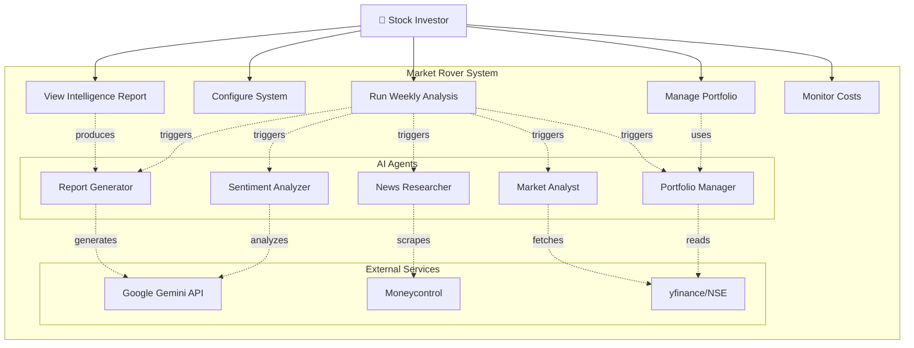

# 🔍 Market Rover - Stock Intelligence System

A multi-agent AI system powered by CrewAI that monitors your stock portfolio, scrapes financial news, performs sentiment analysis, and generates weekly intelligence reports.

## ✨ Features

- **📊 Portfolio Monitoring**: Tracks your NSE stocks from a simple CSV file
- **📰 News Scraping**: Uses Newspaper3k to scrape recent news from Moneycontrol
- **🧠 Sentiment Analysis**: AI-powered classification of news as Positive/Negative/Neutral
- **📈 Market Context**: Analyzes Nifty 50 and sector trends for broader market understanding
- **📝 Weekly Reports**: Generates comprehensive intelligence briefings with risk highlights
- **💰 Cost-Effective**: Free tier available with Google Gemini API
- **🌐 Web Interface**: User-friendly Streamlit web UI (v2.0)
- **📊 Interactive Charts**: Real-time visualizations with Plotly (v2.0)
- **⚡ Parallel Processing**: 5x faster multi-stock analysis (v2.0)

## 🏗️ Architecture

Market Rover uses **5 specialized AI agents** orchestrated by CrewAI:

1. **Portfolio Manager Agent**: Reads and validates your stock portfolio
2. **News Scraper Agent**: Scrapes Moneycontrol using News Paper3k
3. **Sentiment Analyzer Agent**: Classifies news sentiment
4. **Market Context Agent**: Analyzes Nifty 50 and sector trends
5. **Report Generator Agent**: Creates final intelligence report

### Use Case Diagram



**Key Use Cases:**
- **Manage Portfolio**: Add/remove stocks in CSV file
- **Configure System**: Set API keys, preferences, automation
- **Run Analysis**: Execute multi-agent intelligence gathering
- **View Reports**: Review generated insights and recommendations
- **Monitor Costs**: Track OpenAI API usage and expenses

## 🚀 Quick Start

### Prerequisites

- Python 3.8 or higher
- Google Gemini API key (free tier available from [Google AI Studio](https://makersuite.google.com/app/apikey))

### Installation

1. **Clone or navigate to the project directory**:
```bash
cd Market-Rover
```

2. **Install dependencies**:
```bash
pip install -r requirements.txt
```

3. **Set up environment variables**:
```bash
# Copy the example file
copy .env.example .env

# Edit .env and add your Google Gemini API key
# GOOGLE_API_KEY=your-google-api-key-here
```

4. **Prepare your portfolio**:
   - Edit `Portfolio.csv` (or use `portfolio_example.csv` as a template)
   - Format: Symbol, Company Name, Quantity, Average Price
   - Symbols will automatically get .NS suffix for NSE

### Usage

#### Option 1: Web UI (Recommended for v2.0)
```bash
streamlit run app.py
# Opens browser at http://localhost:8501
```

**Features:**
- Upload portfolio via drag-and-drop
- Real-time progress tracking
- Interactive visualizations
- Test mode (mock data, no API costs)
- View saved reports with charts
- Download in multiple formats (TXT, HTML, CSV)

#### Option 2: Command Line
```bash
python main.py
```

The system will:
1. Read your portfolio
2. Scrape news from Moneycontrol for each stock
3. Analyze sentiment and market context
4. Generate a comprehensive report in the `reports/` directory

## 📋 Portfolio File Format

Create a `Portfolio.csv` file with this structure:

```csv
Symbol,Company Name,Quantity,Average Price
RELIANCE,Reliance Industries Ltd,10,2450.50
TCS,Tata Consultancy Services,5,3550.00
INFY,Infosys Ltd,15,1450.75
```

- **Symbol**: Stock symbol (without .NS suffix - it will be added automatically)
- **Company Name**: Full company name
- **Quantity**: Number of shares you own (optional)
- **Average Price**: Your average purchase price (optional)

## ⚙️ Configuration

Edit `config.py` or set environment variables in `.env`:

| Setting | Default | Description |
|---------|---------|-------------|
| `MAX_ITERATIONS` | 15 | Maximum iterations for each agent |
| `LOOKBACK_DAYS` | 7 | How many days back to search for news |
| `PORTFOLIO_FILE` | Portfolio.csv | Path to your portfolio file |
| `CONVERT_TO_CRORES` | true | Convert amounts to Crores |

## 📊 Sample Report Structure

```
═══════════════════════════════════════════
    MARKET ROVER INTELLIGENCE REPORT
═══════════════════════════════════════════

EXECUTIVE SUMMARY
- Overall portfolio health
- Market sentiment this week
- Top 3 most important news stories

STOCK-BY-STOCK ANALYSIS
For each stock:
- Current price and change
- Key news with sentiment
- Risks/opportunities
- Recommendation: WATCH/HOLD/CONCERN

RISK HIGHLIGHTS
- Stocks needing attention
- Market-wide risks
- Flagged items for human review
```

## 💰 Cost Breakdown

### Current Setup (Google Gemini API - December 2025)

**Free Tier (Updated Dec 2025):**
- **Gemini 2.5 Flash**: 2 requests per minute (RPM), 20 requests per day (RPD)
- **Note**: Free tier was reduced from 250 RPD to 20 RPD in early December 2025
- **Best for**: Learning, proof-of-concept, light usage (under 20 requests/day)
- **Alternative**: Gemini 2.5 Flash-Lite offers 30 RPM and 1,500 RPD for free

**Pay-As-You-Go Pricing:**
- **Model**: Gemini 2.5-flash
- **Input tokens**: $0.175 per 1 million tokens
- **Output tokens**: $0.75 per 1 million tokens
- **Data sources**: yfinance + Newspaper3k (both free)
- **Infrastructure**: Run locally (no hosting costs)

### Cost Estimates

**Free Tier Usage:**
- ✅ **1-2 stocks, daily**: Within free limit (under 20 requests/day)
- ✅ **3-5 stocks, weekly**: Comfortably within free tier
- ⚠️ **10+ stocks, daily**: Will exceed free tier (20 RPD limit)

**Paid Tier Estimates (if exceeding free tier):**
- **Cost per analysis run**: ~$0.01-0.05 per stock
- **3 stocks, weekly**: ~$0.60/month (likely free tier sufficient)
- **10 stocks, weekly**: ~$1-2/month
- **20 stocks, daily**: ~$10-15/month

**Comparison:**
- 🎉 **Significantly cheaper than OpenAI** (was ~$0.10-0.20 per run)
- 💰 **10-20x cost reduction** compared to GPT-3.5-turbo

**Recommendation**: Start with free tier for testing, upgrade to pay-as-you-go only if needed.

See official pricing: https://ai.google.dev/pricing

## 🛠️ Technology Stack

### Core AI & Backend
- **CrewAI**: Multi-agent orchestration framework
- **Google Gemini 2.5-flash**: Large Language Model for reasoning
- **langchain-google-genai**: LLM integration layer
- **yfinance**: Free NSE/BSE stock data
- **Newspaper3k**: Web scraping for news articles
- **Pandas**: Data manipulation

### Web UI & Visualizations (v2.0)
- **Streamlit**: Interactive web interface
- **Plotly**: Interactive charts and visualizations
- **HTML Export**: Reports with embedded charts

## 📁 Project Structure

```
Market-Rover/
├── main.py                 # CLI entry point
├── app.py                  # Web UI entry point (v2.0)
├── agents.py               # Agent definitions (Gemini LLM)
├── tasks.py                # Task definitions
├── crew.py                 # Crew orchestration
├── config.py               # Configuration
├── requirements.txt        # Python dependencies
├── .env.example            # Environment template
├── Portfolio.csv           # Your stock portfolio
├── portfolio_example.csv   # Example portfolio
├── tools/
│   ├── portfolio_tool.py      # Portfolio reader
│   ├── news_scraper_tool.py   # Moneycontrol scraper
│   ├── stock_data_tool.py     # Stock data fetcher
│   └── market_context_tool.py # Market analyzer
├── utils/                  # v2.0 utilities
│   ├── job_manager.py         # Job tracking
│   ├── mock_data.py           # Mock data generator
│   ├── parallel_processor.py  # Parallel execution
│   └── report_visualizer.py   # Chart generation
├── test_mock_data.py       # Mock data tests
├── test_gemini_api.py      # API connection test
└── reports/                # Generated reports (TXT, HTML)
```

## 🔧 Troubleshooting

### "No module named 'crewai'"
```bash
pip install -r requirements.txt
```

### "GOOGLE_API_KEY not found"
1. Create a `.env` file in the project root
2. Add: `GOOGLE_API_KEY=your_key_here`
3. Get a free key from: https://makersuite.google.com/app/apikey

### "No news found for stock"
- Check if the stock symbol is correct
- Try running again (Moneycontrol may have rate limits)
- Some stocks may have less news coverage

### News scraping fails
- Newspaper3k may need additional dependencies on Windows:
```bash
pip install lxml lxml_html_clean
```

## 🎯 User Rules Compliance

- ✅ All NSE stocks automatically get `.NS` suffix
- ✅ All financial figures converted to Crores
- ✅ Uses Newspaper3k for Moneycontrol scraping (Agent B)
- ✅ Implements ReAct (Reasoning + Acting) strategy
- ✅ Max 15 iterations with safeguards
- ✅ "Flag for Review" feature for uncertain sentiments

## 📝 License

This project is for personal use. Ensure compliance with data source terms of service.

## 🤝 Contributing

This is a personal portfolio intelligence tool. Feel free to modify for your own needs.

## ⚠️ Disclaimer

This tool provides information only and is not financial advice. Always do your own research before making investment decisions.

---

**Market Rover** - Your intelligent stock portfolio companion 🚀
